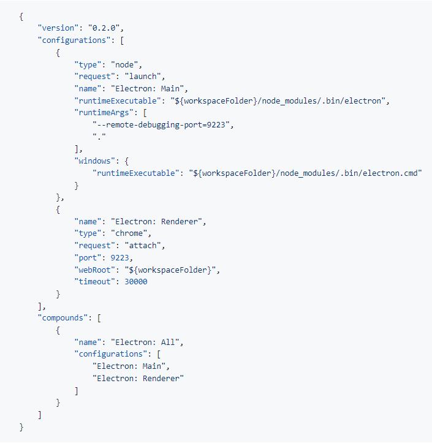

# Electron 开发

## 基本原理

Electron 通过集成nodejs 和 Chromium 可以处理后端和渲染进程直接通信 通过

- `BrowserWindow.loadURL` 和 `BrowserWindow.loadFile` 加载处理渲染进程的代码

在项目的package.json main字段定义node进程的代码

交互可以通过传统的http接口（需要node开启http后端服务），可以使用ipcRender ipcMain MessagePortMain 进行进程通信

## 手动自建项目

根据官网提示创建 nuxt 项目，更改默认目录结构，源代码统一放入src目录下，渲染进程代码放入src/renderer下

主进程放入 src/main 下。如果主进程不适用ts,直接 在package.json main指定路径

全局安装 concurrently 用于执行多个命令； 修改执行脚本命令 concurrently \"nuxt dev\" \" electron . \"  执行pnpm dev 启动

使用ts 创建js文件处理 ts 编译为 js 这里使用脚本执行, 使用的包没有的安装下

```js
import chokidar from 'chokidar';
import ts from 'typescript';
import { readFileSync, writeFileSync, unlinkSync, existsSync, mkdirSync } from 'fs';
import path from 'path';

function createTransformer() {
  return (context) => {
    return (sourceFile) => {
      function visitor(node) {
        if (ts.isImportDeclaration(node) || ts.isExportDeclaration(node)) {
          if (node.moduleSpecifier && ts.isStringLiteral(node.moduleSpecifier)) {
            const importPath = node.moduleSpecifier.text;
            if (importPath.endsWith('.ts')) {
              const updatedNode = ts.factory.updateImportDeclaration(
                node,
                node.modifiers,
                node.importClause,
                ts.factory.createStringLiteral(importPath.replace(/\.ts$/, '.js'))
              );
              return updatedNode;
            }
          }
        }
        return ts.visitEachChild(node, visitor, context);
      }
      return ts.visitNode(sourceFile, visitor);
    };
  };
}

// 编译 TypeScript 文件的函数
const compileTS = (filePath) => {
  const input = readFileSync(filePath, 'utf-8');
  const result = ts.transpileModule(input, {
    compilerOptions: {
      module: ts.ModuleKind.ESNext,
      target: ts.ScriptTarget.ESNext,
      strict: true,
      noImplicitAny: false,
      sourceMap: true,
      experimentalDecorators: true,
      skipLibCheck: true,
      allowJs: true,
      checkJs: false,
      allowArbitraryExtensions: true,
      resolveJsonModule: true,
      baseUrl: './'
    },
    transformers: {
      after: [createTransformer()]
    }
  });
  const outputFilePath = filePath
    .replace(/ts$/, 'js')
    .replace(/electron\\/, '')
    .replace(/^src\\/, 'electronDir\\');
  const sourceMapFilePath = `${outputFilePath}.map`;

  // 确保输出目录存在
  const outputDir = path.dirname(outputFilePath);
  if (!existsSync(outputDir)) {
    mkdirSync(outputDir, { recursive: true });
  }

  // 添加 sourceMappingURL 注释
  const outputTextWithMap = `${result.outputText.replace(/\/\/# sourceMappingURL=.+$/, '')}\n//# sourceMappingURL=${path.basename(sourceMapFilePath)}`;
  writeFileSync(outputFilePath, outputTextWithMap);
  if (result.sourceMapText) {
    const sourceMap = JSON.parse(result.sourceMapText);
    sourceMap.file = path.basename(outputFilePath);
    sourceMap.sources = [path.relative(outputDir, filePath).replace(/\\/g, '/')];
    const modifiedSourceMapText = JSON.stringify(sourceMap);
    writeFileSync(sourceMapFilePath, modifiedSourceMapText);
  }
  console.log(`Compiled ${filePath} to ${outputFilePath}`);
};

// 要监控的 TypeScript 文件路径或目录
const watchPath = ['./src/electron/**/*.ts', './src/electron/**/*.mts'];

// 初始化文件监听
const watcher = chokidar.watch(watchPath, {
  ignored: /node_modules/,
  persistent: true
});

// 监听文件变化事件
watcher
  .on('add', (filePath) => compileTS(filePath))
  .on('change', (filePath) => compileTS(filePath))
  .on('unlink', (filePath) => {
    const outputFilePath = filePath.replace(/\ts$/, 'js');
    if (existsSync(outputFilePath)) {
      unlinkSync(outputFilePath);
      console.log(`Deleted ${outputFilePath}`);
    }
  });

```


修改执行脚本命令  concurrently \"node index.mjs\" \"nuxt dev\" \" electron . \"  执行pnpm dev 启动

### 调试

github 微软有个 vscode-recipes 项目里面写了常用的 vscode调试配置，找到electron 的对应文件 复制，在项目根目录下，创建.vscode目录 创建 luanch.json 文件 将内容复制进去。此时就可以开启vscode调试功能，调试主进程代码



## 使用现成的脚手架

vite-electron 文件目录，vue，ts ,eslint 资源处理，打包，升级 都有基础配置，方便开发，支持字节码加密

按照官网说明使用即可，中文支持友好