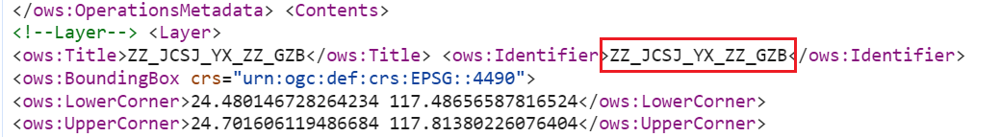
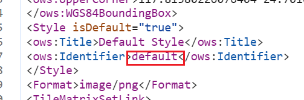
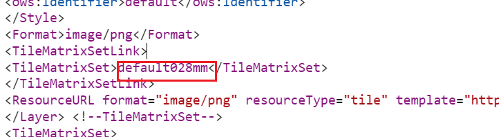
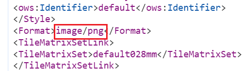
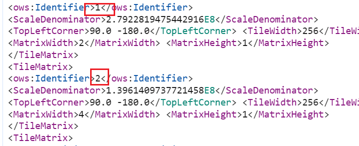

### 1. 获取ArcGis服务配置信息

要在url地址后面加上`?request=GetCapabilities&service=wmts`获取配置信息

```javascript
//例子
/arcgis/rest/services/ZZ_JCSJ/YX_ZJ_ZZ_GZB_2023/MapServer/?request=GetCapabilities&service=wmts
```

### 2. 使用Cesium.WebMapTileServiceImageryProvider类加载WMTS瓦片

根据配置信息填写参数



对应 `layer`



对应 `style`



对应 `tileMatrixSetID`



对应 `format`



对应 `tileMatrixLabels`  里面是数组，类型字符串

### 3. 使用 ArcGisMapServerImageryProvider.fromUrl加载ArcGis服务

直接填写url即可，但是要注意确认url后面加上 `?f=json`能否获取到json信息获取不到不能使用该方法